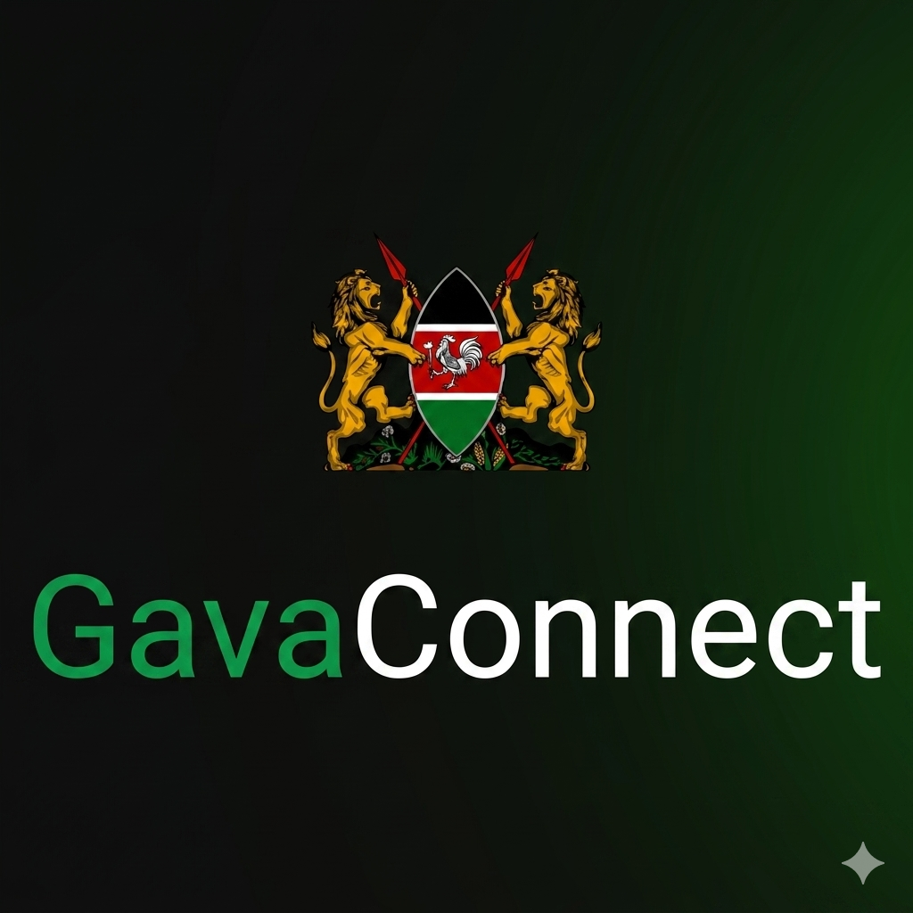

# Welcome to GavaConnect

<p align="center">
  
</p>

<p align="center">
  Building seamless integrations through powerful, developer-friendly SDKs.
</p>

---

## About GavaConnect

GavaConnect provides a suite of SDKs, APIs, and developer tools that enable organizations to integrate with the GavaConnect platform quickly and reliably.

Our mission is to make integrations simple, secure, and scalable across multiple programming languages and platforms.

---

## Available SDKs

| SDK                        | Language                | Status |
| -------------------------- | ----------------------- | ------ |
| GavaConnect Java SDK       | Java                    | in-progress |
| GavaConnect JavaScript SDK | JavaScript / TypeScript | - |
| GavaConnect Python SDK     | Python                  | - |
| GavaConnect .NET SDK       | C# / .NET               | - |
| GavaConnect Go SDK         | Go                      | - |

> Additional SDKs and tooling are continuously being developed.

---

## 🛠 Developer Resources

* API Documentation
* SDK Guides
* Integration Tutorials
* Release Notes
* Sample Applications

Refer to the documentation provided within each SDK repository for language-specific setup instructions and examples.

---

## Getting Started

1. Choose the SDK that matches your development stack.
2. Install the SDK using your language's package manager.
3. Configure authentication credentials.
4. Start making API calls to the GavaConnect platform.

Example:

```bash
# Example installation
npm install @gavaconnect/sdk
```

```python
# Example usage
from gavaconnect import Client

client = Client(api_key="YOUR_API_KEY")

response = client.example_operation()
print(response)
```

---

## Contributing

We welcome contributions from the community.

To contribute:

1. Fork the repository.
2. Create a feature branch.
3. Make your changes.
4. Submit a pull request.

Please review each repository's contribution guidelines before submitting changes.

---

## Security

If you discover a security vulnerability, please report it responsibly by contacting the GavaConnect security team.

Do not disclose security issues publicly until they have been reviewed and addressed.

---

## Support

Need help?

* Review the documentation.
* Open an issue in the relevant SDK repository.
* Contact the GavaConnect support team.

---

## Connect With Us

Follow updates, releases, and announcements from the Marcus Mosaya.

---

Made with ❤️ by the Marcus Mosaya
